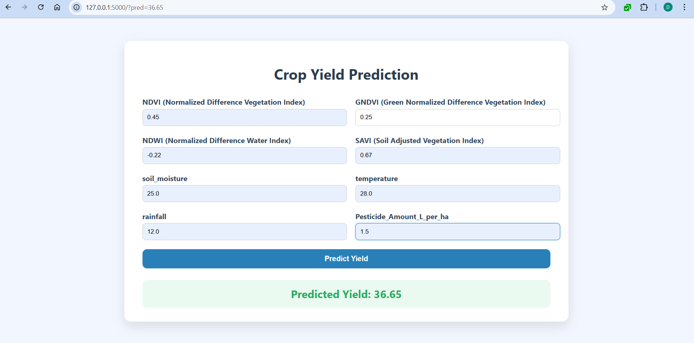

# Crop Yield Prediction Using Machine Learning

## Project Overview

Accurate crop yield prediction is essential for improving agricultural productivity, planning resource usage, and supporting farmers in decision-making.
This project presents a **machine learning–based web application** that predicts crop yield using **climate, soil, vegetation indices, and pesticide usage data**.

The system is designed to be **simple, scalable, and practical**, combining data preprocessing, model training, and real-time prediction through a web interface.


## Objectives

* Analyze the impact of **environmental and agricultural factors** on crop yield
* Build a **robust regression model** for yield prediction
* Deploy the model using a **Flask web application**
* Provide an **easy-to-use UI** for real-time predictions


## Features Used

The prediction model is trained using the following categories of features:


### Climate Factors

* Temperature
* Rainfall
* Humidity

### Vegetation Indices (Remote Sensing)

* **NDVI** – Normalized Difference Vegetation Index
* **GNDVI** – Green Normalized Difference Vegetation Index
* **NDWI** – Normalized Difference Water Index
* **SAVI** – Soil Adjusted Vegetation Index

### Agricultural Input

* **Pesticide Amount** – included to capture crop protection impact


## Tech Stack

* **Programming Language:** Python
* **Libraries:**
  * Pandas, NumPy
  * Scikit-learn
  * Matplotlib / Seaborn
* **Machine Learning Model:** Random Forest Regressor
* **Web Framework:** Flask
* **Frontend:** HTML, CSS
* **Development Environment:** VS Code


## System Architecture

1. Data collection and cleaning
2. Feature preprocessing & encoding
3. Model training and evaluation
4. Model serialization (`.pkl`)
5. Flask-based web interface for predictions

## How to Run the Project

### 1️. Clone the Repository

```bash
git clone https://github.com/22b01a12c4/crop-yield-prediction.git
cd crop-yield-prediction
```

### 2️. Create Virtual Environment (Optional but Recommended)

```bash
python -m venv venv
venv\Scripts\activate   # Windows
```

### 3️. Install Dependencies

```bash
pip install -r requirements.txt
```

### 4️. Run the Application

```bash
python app.py
```

### 5️. Open in Browser

```
http://127.0.0.1:5000
```

### Preview
